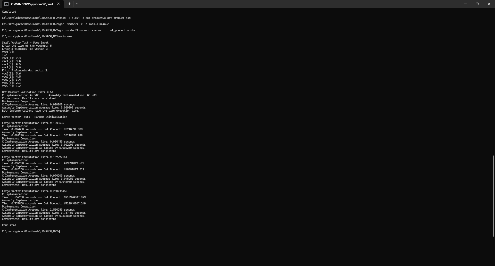
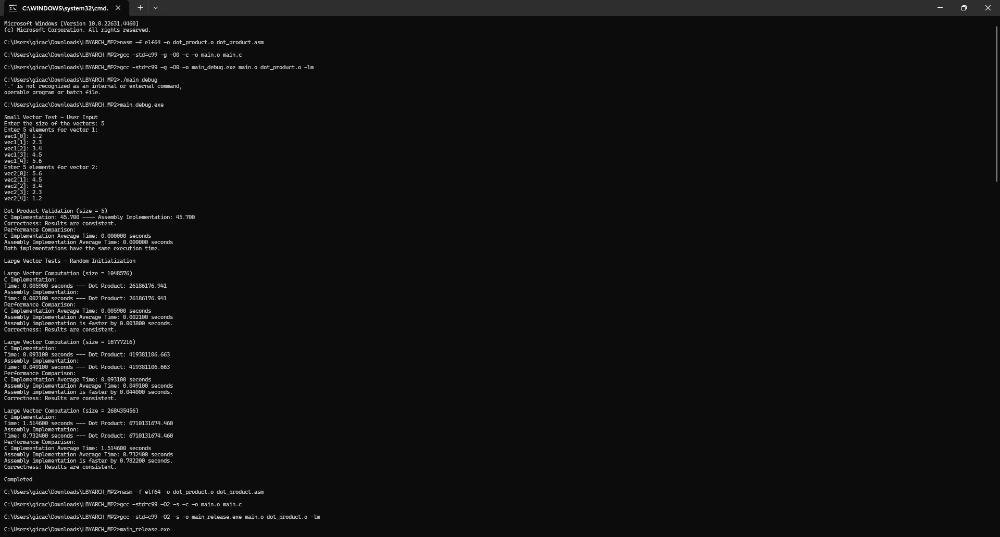

# LBYARCH_MP2
- MP GRP 13 LBYARCH S15
- CLAVANO, ANGELICA THERESE IGNACIO (Jack)
- ALEJANDRINO, VINCE ALEJSON VIERNES
- sdot = \sum_{i=1}^{n} a_i b_i = a_1*b_1 + a_2*b_2 + ... + a_n*b_n

## How to run - CLEAN
1. nasm -f elf64 -o dot_product.o dot_product.asm
2. gcc -std=c99 -c -o main.o main.c
3. gcc -std=c99 -o main.exe main.o dot_product.o -lm
4. main.exe
- -std=c99: uses c99 standard
- -lm: links math library to the executable

## How to run - DEBUG
1. nasm -f elf64 -o dot_product.o dot_product.asm
2. gcc -std=c99 -g -O0 -c -o main.o main.c
3. gcc -std=c99 -g -O0 -o main_debug.exe main.o dot_product.o -lm
4. ./main_debug.exe OR main_debug.exe
- O0: no optimization

## How to run - RELEASE
nasm -f elf64 -o dot_product.o dot_product.asm
gcc -std=c99 -O2 -s -c -o main.o main.c
- O2: optimization level 2, high optimization
gcc -std=c99 -O2 -s -o main_release.exe main.o dot_product.o -lm
./main_release.exe

## Raw Output Screenshots

## Comparative Execution time and short analysis of the performance of the kernels

## Screenshot of the program output and correctness check (C and x86-64)

## Disclaimer - Processor
- The processor used in the test has AMD Ryzen 7 5825U with Radeon Graphics 2.00GHz with 16.0 GB (14.8 GB usable)
- GCC Version is 14.1.0

## MP Assignment Screenshot

## Short videos (5-10 minutes) showing the source code, compilation, execution of the C and x86-64 program
- Youtube: https://youtu.be/yEa_ip2xw1I
- Google Drive (requires DLSU email): https://drive.google.com/file/d/1Uy5RMjb1jRGSkISX__-L-HzG16l4HASV/view?usp=drive_link